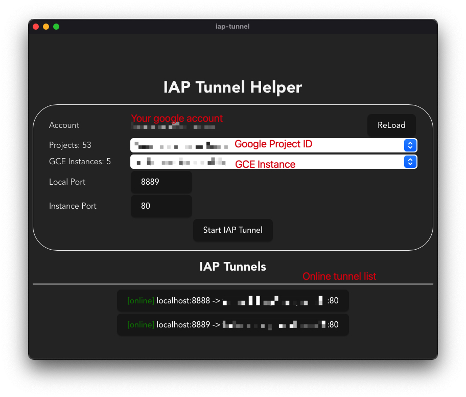
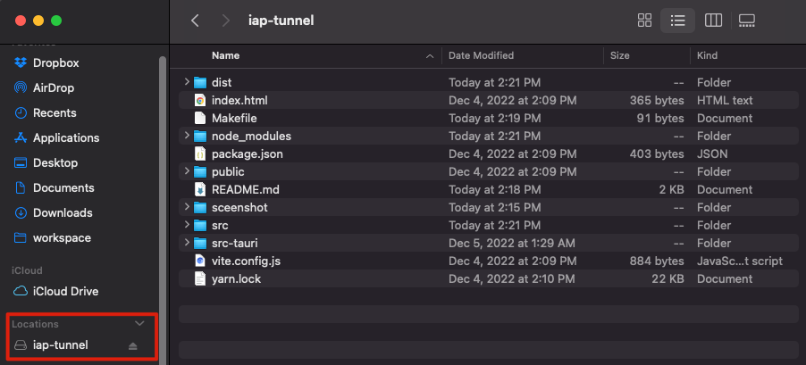

# IAP Tunnel Helper

A GUI wrapper for `gcloud` command to manage IAP tunnels.

**_It's a poc for [Tauri](https://tauri.app/) GUI application development_**

## Introduction

IAP(Identity-Aware Proxy) is a security feature of Google Cloud Platform.

It can create a tunnel to forward local port to remote GCE instance port.

Document: https://cloud.google.com/iap/docs/tcp-forwarding-overview

It's useful in debug or maintenance. The command looks like:

```
gcloud compute start-iap-tunnel \
  --project <GCP_PROJECT_ID> \
  --zone <GCE_INSTANCE_ZONE> \
  --local-host-port localhost:<LOCAL_PORT> \
  <GCE_INSTANCE_NAME> \
  <GCE_INSTANCE_PORT>
```

When your instances are located multi-zone. It's annoying to specific <GCE_INSTANCE_PORT>.

You can create multi tunnels to forward different GCE Instance in different projects.



# Initial project

## Install rust

https://www.rust-lang.org/tools/install

In MacOS

```
curl --proto '=https' --tlsv1.2 https://sh.rustup.rs -sSf | sh
```

## Install node npm, and yarn

https://nodejs.org/en/download/

```
npm install --global yarn
```

## Install node packages

In project directory

```
yarn
```

# Development mode

In project directory

```
yarn tauri dev

# or 

make
```

# Build

## Debug mode

```
yarn run tauri build --debug

# or

make build
```

Application will be created in `src-tauri/target/debug`.

## Release mode

```
yarn run tauri build

# or

make release
```

Application will be created in `src-tauri/target/release`.

## Notice

If you're build on the **MacOS** platform, it would mount a volume to create dmg.

If it does not unmount automatically, you should unmount the volume before build, or you will build fail.



# Application Usage

1. Install `gcloud` CLI, follow the official document: https://cloud.google.com/sdk/docs/install
2. Init `gcloud ` command, login your google account.
3. Open the application, it will load your environment variable and call `gcloud` automatically.
